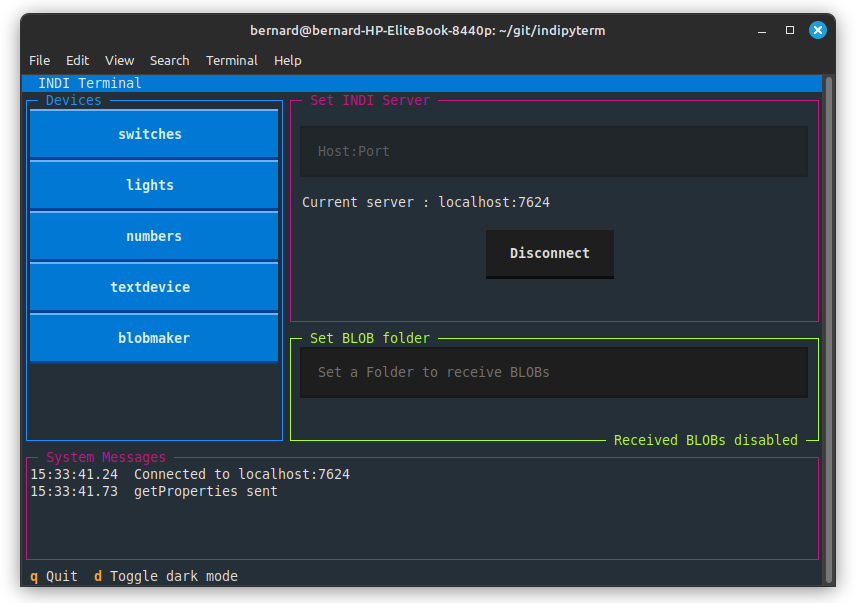
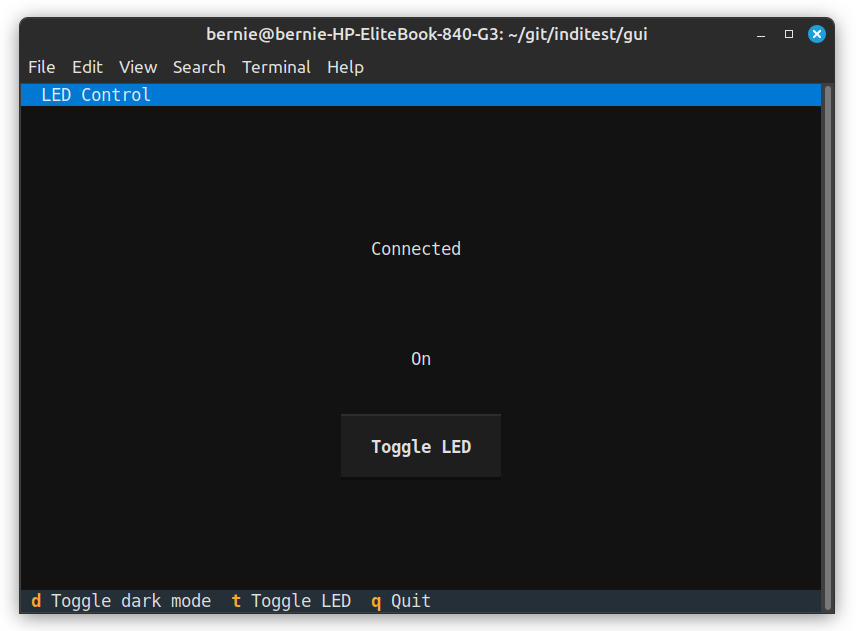

Concept
=======

The associated package 'indipydriver' can be used to take your data, organise it into a structure defined by the INDI protocol, and serve it on a port.

The INDI protocol (Instrument Neutral Distributed Interface) specifies a limited number of ways the data can be presented, as switches, lights, text, numbers and BLOBs (Binary Large Objects), together with grouping and label values which may be useful to display the data.

This 'indipyclient' package contains classes which make the connection to the server, decode the protocol, and present the data as class attributes, and have methods which can transmit data.

Note: other INDI servers and clients are available. See :ref:`references`.

The INDI Protocol
-----------------

The protocol is defined at:

https://www.clearskyinstitute.com/INDI/INDI.pdf

Asynchronous operation
----------------------

The indipyclient classes send and receive data asynchronously, and the ipyclient.asyncrun() coroutine method, when awaited, causes the client to make its call and run.

The asyncrun method could be gathered together with any of your own coroutines, or could be called with the asyncio.run() call.

Assuming ipyclient is your instance of the IPyClient class.

If your own code is blocking, then you will probably need to await ipyclient.asyncrun() in another thread, a common method would be to introduce queues to pass data between threads. To help with this, IPyClient has a snapshot() method which returns a copy of the state of the client, with devices, vectors and members, but without the methods to send or update data. This snapshot could be passed to other threads providing them with the current client information. See :ref:`queclient`.

Receiving Example
-----------------

This script monitors a remote "Thermostat" and prints the temperature as events are received. The thermostat driver is described as an example at https://indipydriver.readthedocs.io

The script checks for a setNumberVector event, and if the event matches the device, vector and member names, prints the received value. This continues indefinitely, printing the temperature as values are received::

    import asyncio
    import indipyclient as ipc

    class MyClient(ipc.IPyClient):

        async def rxevent(self, event):
            "Prints the temperature as it is received"
            if isinstance(event, ipc.setNumberVector):
                if event.devicename != "Thermostat":
                    return
                if event.vectorname != "temperaturevector":
                    return
                # use dictionary get method which returns None
                # if this member name is not present in the event
                value = event.get("temperature")
                if value:
                    print(value)

    ipclient = MyClient()

    asyncio.run(ipclient.asyncrun())

As well as IPyClient, the function getfloat(value) is available which, given a string version of a number as described in the INDI specification, will return a float. This could be used in the above example to ensure value is a float.

.. autofunction:: indipyclient.getfloat

Sending data
------------

To transmit a new value to the server you could call the ipyclient.send_newVector coroutine method

Or if you have a vector object, obtained from ipyclient[devicename][vectorname], you could call its specified send method, for example vector.send_newSwitchVector, these are called with the appropriate new member values.

Each vector has a state attribute, set to a string, one of "Idle", "Ok", "Busy" or "Alert".

When a send method is called, the vector's state is automatically set to "Busy", and when a 'set' packet is received, it will update the ipyclient values and also provide confirmation of the changed state by setting it to "Ok".

Timeouts
--------

Whenever you send updated values, a timer is started and if a timeout occurs before the server responds, a VectorTimeOut event will be created, which you could choose to ignore, or take action such as setting an Alert flag.

The INDI protocol allows the server to suggest a timeout for each vector. The ipyclient.set_vector_timeouts method allows you to set minimum and maximum timeouts which restricts the suggested values between a minimum and maximum value.

The method also has a timeout_enable argument which enables or disables the VectorTimeOut event and also enables two other timers:

ipyclient.idle_timeout is set to twice timeout_max, and will cause a getProperties to be sent if nothing is either transmitted or received in that time.

ipyclient.respond_timeout is set to four times timeout_max, and will assume a call failure and attempt a reconnect, if after any transmission, nothing is received for that time.

If the timeout_enable argument is set to False, then these timeouts are disabled, and you have the freedom to implement any of your own timing controls.

The INDI standard states:

*The Device will eventually send a state of Ok if and when the new values for the Property have been successfully accomplished according to the Devices criteria, or send back Alert if they can not be accomplished with a message explaining why.*

Note 'Property' and 'Vector' are interchangeable terms. The spec also states:

*Timeout values give Clients a simple ability to detect dysfunctional Devices or broken communication...*

You have the option of handling timeouts however you prefer.

BLOBs
-----

BLOBs received by the client will appear as a bytes object in a setBLOBVector event, but when a client first connects, the server assumes that transmitting BLOBs to the client is disabled. To enable BLOB's the client must transmit an enableBLOB command.

The ipclient does this automatically on receiving a vector definition packet. It sends one of the values:

**Never**

This disables BLOBs.

**Also**

This enables BLOBs, which will be sent together with any other vectors generated by the driver.

**Only**

This enables BLOBs, but disallows any other vectors, so the connection is dedicated to BLOBs only.

The default value automatically sent in the enableBLOB command will be "Never", but this default can be changed by setting the client enableBLOBdefault attribute, so if this is set to 'Also', then receiving all BLOBs will be enabled.

If fine control of which devices and vectors can receive BLOBs from the server, then the IPyClient object has the following method:

async def send_enableBLOB(self, value, devicename, vectorname=None)

Where value is one of the strings Never, Also or Only.

The devicename must be specified, but if the vectorname is not, the command applies to all BLOBs from that device.

If devicename and vectorname are both specified, the command applies to that particular vector.

So by leaving enableBLOBdefault as "Never", and using the above method to send an "Also" for a particular device, you can limit BLOBs sent by the server to just that device.

A further facility is available, which has precedence over the above options, if the client attribute BLOBfolder is set to a directory, the client will automatically enable all BLOB's (by sending Also), and will save any received BLOBs to a file within the given directory.

If BLOBfolder is subsequently set to None, the client will send the enableBLOBdefault attribute, which is typically "Never", turning off BLOBs.

So if writing your own client, simply setting ipclient.BLOBfolder to a directory path will enable BLOBs and save incoming BLOBs to the directory, and you can ignore the incoming setBLOBVector event.

Logging
-------

This indipyclient package uses the Python standard library logging module, it uses logger with name "indipyclient" and emits logs at levels:

**ERROR**

Logs errors including tracebacks from exceptions

**WARNING**

Logs connection status and warnings

**INFO**

Logs informational messages.

**DEBUG**

Logs xml data transmitted and received. The verbosity of this xml data can be set with the IPyClient.debug_verbosity(verbose) method, where 0 is no xml traffic is recorded, 1 is xml recorded but the least verbose, and 3 is the most.

To record logs you will need to add a handler, and a logging level, for example::

    import logging
    logger = logging.getLogger('indipyclient')

    fh = logging.FileHandler("logfile.log")
    logger.addHandler(fh)

    logger.setLevel(logging.DEBUG)

This leaves you with the flexibility to add any available loghandler, and to set your own formats if required.

As default, logs at level WARNING and above will appear on your console, which may be distracting. You could add a NullHandler to the start of your script if you do not want any output to be displayed::

    import logging
    logger = logging.getLogger()
    logger.addHandler(logging.NullHandler())

Terminal Example
----------------

A terminal client has the advantage that with a headless setup, a remote user can simply SSH to the server and run the client.

The package indipyterm is available which uses IPyClient and textualize - a framework that creates terminal applications, to create a full general purpose terminal client. It is also available from Pypi.

https://pypi.org/project/indipyterm

The client can be run from a virtual environment with

indipyterm [options]

or with

python3 -m indipyterm [options]

If you use uv, it can be very simply run directly from Pypi with

uvx indipyterm [options]

The package help is:

.. code-block:: text

    usage: indipyterm [options]

    Terminal client to communicate to an INDI service.

    options:
      -h, --help               show this help message and exit
      --port PORT              Port of the INDI server (default 7624).
      --host HOST              Hostname/IP of the INDI server (default localhost).
      --blobfolder BLOBFOLDER  Optional folder where BLOB's will be saved.
      --version    show program's version number and exit

A typical session would look like:

Further information about indipyterm can be found from:

https://github.com/bernie-skipole/indipyterm

indipyterm uses the textual package to generate its output, and using textual_serve (available from Pypi) indipyterm can be served as a web service, and viewed with a browser. Simply write a file and run:

.. code-block:: text

    from textual_serve.server import Server

    server = Server("python -m indipyterm")

    server.serve()

Then connect with your browser to localhost:8000 and the terminal will be displayed.

Using indipyclient and textual it would be possible to write your own terminal clients, dedicated to a specific instrument. By being dedicated to a known device, vector and member, it does not need to 'learn' about remote devices but can simply display the expected instrument, making creating a specialist client much easier, nevertheless this would require a good knowledge of textual. A simplified example, (ledclient4.py) has been written at:

https://github.com/bernie-skipole/inditest/tree/main/gui

This is not general purpose, but is dedicated to controlling an LED driver, also listed in the above directory. A screenshot is shown below:

