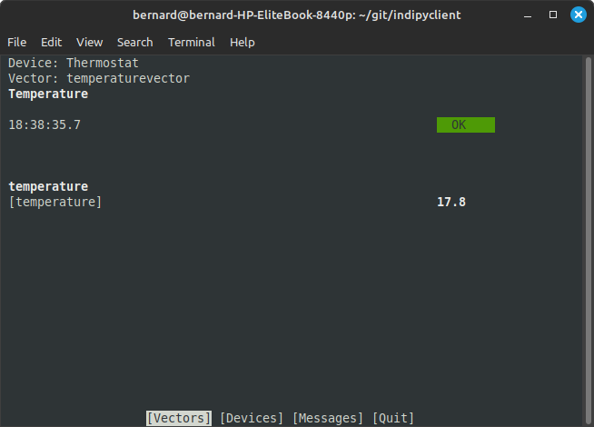

Introduction
============

You may have Python programs reading or controlling any form of data collection or control.

An associated package 'indipydriver' consists of classes IPyDriver and IPyServer which can be used to take your data, organise it into an xml data structure as defined by the INDI protocol, and serve it on a port.

This indipyclient package provides a terminal client, which connects to the port, allowing you to view and control your instrument from a terminal session.

indipydriver and indipyclient communicate with the INDI protocol.

INDI - Instrument Neutral Distributed Interface.

See https://en.wikipedia.org/wiki/Instrument_Neutral_Distributed_Interface

The protocol defines the format of the data sent by the driver, such as light, number, text, switch or BLOB (Binary Large Object). The client can be general purpose, taking the format of switches, numbers etc., from the protocol and can send commands to control the instrument.

INDI is often used with astronomical instruments, but is a general purpose protocol which can be used for any instrument control providing drivers are available.

The companion package 'indipydriver', which is used to create drivers, is available on Pypi and developed at.

https://github.com/bernie-skipole/indipydriver

The indipyclient terminal can be started from the command line, and can also be imported if required, in which case it provides a set of classes which can be used to create scripts to control the remote instrument.

The client can be run with

indipyclient [options]

or with

python3 -m indipyclient [options]

The package help is::

    usage: indipyclient [options]

    Terminal client to communicate to an INDI service.

    options:
      -h, --help            show this help message and exit
      -p PORT, --port PORT  Port of the INDI server (default 7624).
      --host HOST           Hostname/IP of the INDI server (default localhost).
      -b BLOBS, --blobs BLOBS
                            Optional folder where BLOB's will be saved.
      --loglevel LOGLEVEL   Enables logging, value 1, 2, 3 or 4.
      --logfile LOGFILE     File where logs will be saved
      --version             show program's version number and exit

    The BLOB's folder can also be set from within the session.
    Setting loglevel and logfile should only be used for brief
    diagnostic purposes, the logfile could grow very big.
    loglevel:1 Information and error messages only,
    loglevel:2 As 1 plus xml vector tags without members or contents,
    loglevel:3 As 1 plus xml vectors and members - but not BLOB contents,
    loglevel:4 As 1 plus xml vectors and all contents

A typical session would look like:

The rest of this document describes the classes available in indipyclient which could be imported to provide your own client scripts, however if you are just using the terminal feature, there is no need to import these functions, and simply running indipyclient from the command line, as show above, will be sufficient.
