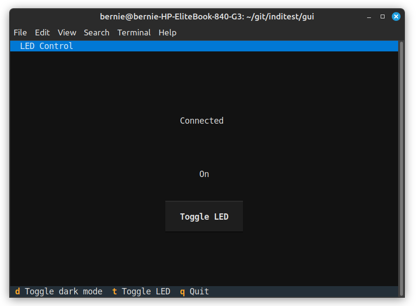

Introduction
============

This indipyclient package provides a classes used to communicate to an INDI server. In particular your script can import and create an instance of the 'IPyClient' class.

INDI - Instrument Neutral Distributed Interface.

See https://en.wikipedia.org/wiki/Instrument_Neutral_Distributed_Interface

INDI is often used with astronomical instruments, but is a general purpose protocol which can be used for any instrument control.

The INDI protocol defines the format of the data sent, such as light, number, text, switch or BLOB (Binary Large Object). The client takes the format of switches, numbers etc., from the protocol.

The IPyClient object has an asyncrun() coroutine method which needs to be awaited, typically gathered with your own tasks. The client transmits a 'getProperties' request (this indipyclient package does this for you on connecting).

The server replies with definition packets (defSwitchVector, defLightVector, .. ) that define the format of the instrument data.

The indipyclient package reads these, and its IPyClient instance becomes a mapping of the devices, vectors and member values.

For example, if ipyclient is your instance of IPyClient:

ipyclient[devicename][vectorname][membername] will be the value of a particular parameter.

A 'vector' is a collection of members, so a switch vector may have one or more switches in it.

As the instrument produces changing values, the server sends 'set' packets, such as setSwitchVector, setLightVector ..., these contain new values, which update the ipyclient values. They also cause the ipyclient.rxevent(event) method to be called, which you could overwrite to take any actions you prefer.

To transmit a new value you could call the ipyclient.send_newVector coroutine method.

Indipyclient can be installed from Pypi with::

    pip install indipyclient

The rest of this document describes the classes available in indipyclient which could be imported to provide your own client scripts.

indipyterm
----------

indipyclient is a library only, which can be used to create a client or client scripts controlling the devices. However 'indipyterm' is available if you prefer a full ready-made client. It is a terminal client which has the advantage that with a headless setup, a remote user can simply SSH to the server and run the client.

indipyterm uses IPyClient and textualize - a framework that creates terminal applications. It can be installed from Pypi.

https://pypi.org/project/indipyterm

The client can be run from a virtual environment with

indipyterm [options]

or with

python3 -m indipyterm [options]

If you use uv, it can be very simply run directly from Pypi with

uvx indipyterm [options]

The package help is:

.. code-block:: text

    usage: indipyterm [options]

    Terminal client to communicate to an INDI service.

    options:
      -h, --help               show this help message and exit
      --port PORT              Port of the INDI server (default 7624).
      --host HOST              Hostname/IP of the INDI server (default localhost).
      --blobfolder BLOBFOLDER  Optional folder where BLOB's will be saved.
      --version    show program's version number and exit

A typical session would look like:

.. image:: ./image2.png

Further information about indipyterm can be found from:

https://github.com/bernie-skipole/indipyterm

Using textual_serve (available from Pypi) indipyterm can be served as a web service, and viewed with a browser. Simply write the following file and run it:

.. code-block:: text

    from textual_serve.server import Server

    server = Server("python -m indipyterm")

    server.serve()

Then connect with your browser to localhost:8000 and the terminal will be displayed.

Using indipyclient and textual it would be possible to write your own terminal clients, dedicated to a specific instrument. By being dedicated to a known device, vector and member, it does not need to 'learn' about remote devices but can simply display the expected instrument, making creating a specialist client much easier, nevertheless this would require a good knowledge of textual. A simplified example, (ledclient4.py) has been written at:

https://github.com/bernie-skipole/inditest/tree/main/gui

This is not general purpose, but is dedicated to controlling an LED driver, also listed in the above directory. A screenshot is shown below:

