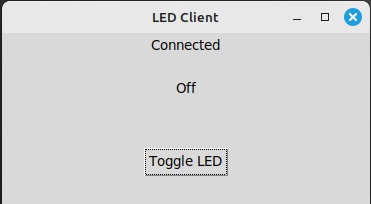
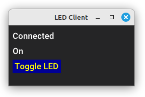

.. _queclient:

QueClient
=========

Using IPyClient is convenient for creating a script to control a remote instrument, however if you want to make your own client you may prefer to run the async code in one thread, and perhaps a GUI display or other blocking code, in another.

Creating a full general purpose client which 'learns' devices and their properties is a large task, but creating a client to match a known instrument, in which the devices, vectors and members are already known, is simpler, and gives you the opportunity to create an elegant display.

A common method would be to introduce queues to pass data between threads.

A class 'QueClient' in module indipyclient.queclient is available if you wish to use it, together with a function that when called with transmit and receive queues will instantiate and run the class.

.. autoclass:: indipyclient.queclient.QueClient
   :members: debug_verbosity, asyncrun, set_user_string

As QueClient inherits from PyClient it also has methods send_newVector etc., but these would not normally be called, since the point of this class is to send and receive all data via the two queues. The format of the items in these queues is described below.

A function runqueclient is provided which can be used to create and run a QueClient.

.. autofunction:: indipyclient.queclient.runqueclient

This does no more than create an instance of QueClient and then uses asyncio.run(client.asyncrun()) to run it.

For example, to run a QueClient in a thread, first create two queues::

    txque = collections.deque(maxlen=4)
    rxque = collections.deque(maxlen=4)

Then run the function runqueclient in its own thread::

    clientthread = threading.Thread(target=runqueclient, args=(txque, rxque))
    clientthread.start()

Then, with your own code, read rxque, and transmit on txque.

To exit, use txque.append(None) to shut down the queclient, (or use put(None) for other forms of queue) and finally wait for the clientthread to stop::

    txque.append(None)
    clientthread.join()

The items passed in these queues are described below:

txque
=====

For thread safety txque can be either a queue.Queue, or a collections.deque object.

It could also be an asyncio.Queue if you are not running a separate thread, but want to use a QueClient with your own asynchronous code.

Your code should place items for transmission onto this queue, typically in response to a user action.

If you have set txque to be a collections.deque object, you should use txque.append(item) to set items on the right of the queue, as the QueClient will read it with popleft.

The possible items are:

**None**

This indicates the QueClient should shut down.

**(devicename, vectorname, value)**

A three item tuple or list, where value is either a string or a membername to membervalue dictionary.

If a string it should be one of "snapshot", "Get", "Never", "Also", or "Only".

Sending the string "snapshot" is a request for the current snapshot of the client, which will be returned via the rxque. Your code could send this on startup to obtain an initial working snapshot of client data.

If devicename and vectorname are None, the snapshot returned will be the full client snapshot, if devicename is specified, but vectorname is None it will be the device snapshot, and if vectorname is specified as well it will be the vector snapshot.

If the value is set to the string "Get" then a getProperties request will be sent. This is normally not necessary as the QueClient automatically sends getProperties on connection to learn the instrument parameters.

If value is set to one of "Never", "Also", "Only" an enableBLOB with this value will be sent.

For example, to enable receipt of BLOBs from a device on this server, without specifying a vector::

    # send an enable blobs request
    txque.append((devicename, None,  "Also"))

To update values on the server, value should be a dictionary {membername:membervalue,...} where the members are that of the specified device and vector.

If the vector is a BLOB Vector, the value dictionary should be {membername:(blobvalue, blobsize, blobformat)...}

The blobvalue could be a bytes object, a pathlib.Path, a string path to a file or a file-like object. If blobsize of zero is used, the size value sent will be set to the number of bytes in the BLOB.

rxque
=====

rxque can be either a queue.Queue, a collections.deque object, or (if you are not using threading) an asyncio.Queue.

As data is received from the server, the QueClient will place items on this queue which your code should receive.  If you have set rxque to be a collections.deque object, the items will be appended on the right of the queue, so your code should use popleft or read rxque[0].

The items placed will be a named tuple with five attributes:

**item.eventtype**

A string, normally one of "Message", "getProperties", "Delete", "Define", "DefineBLOB", "Set" or "SetBLOB".

These indicate data is received from the client, and the type of event.

Other strings, which do not indicate a received event, but are generated by the QueClient

"snapshot", which is a response to a snapshot request received from txque.

"TimeOut", which indicates an expected update has not occurred.

"State", which is set immediately after you have sent a new vector on txque, in this case the snapshot will show the vector state as "Busy".

**item.devicename**

Either the device name causing the event, or None where a device name is not relevant.

**item.vectorname**

Either the vector name causing the event, or None.

**item.timestamp**

The event timestamp, or None for the snapshot request.

**item.snapshot**

A Snap object, if eventtype is "snapshot" it will be the snapshot requested, for any other eventtype a full client snapshot will be given.

Your code would typically inspect the snapshot, and operate any function you require on the updated values.

Example
^^^^^^^

The following example prints temperature on request. example1.py should be set running in another process::

    import threading, collections

    from indipyclient.queclient import runqueclient

    # create two queues

    # rxque giving received data with length of one so old
    # measurements are bumped off and rxque[0] is always the latest.

    rxque = collections.deque(maxlen=1)
    txque = collections.deque()

    # run the queclient in its own thread
    clientthread = threading.Thread(target=runqueclient, args=(txque, rxque))

    # The args argument could also have hostname and port specified
    # if the Thermostat server is running elsewhere
    clientthread.start()

    # The following code is synchronous and blocking

    # request an initial client snapshot
    txque.append((None, None,"snapshot"))
    print("Input a T for temperature, or Q for Quit")
    while True:
        value = input("T or Q:")
        if value == "t" or value == "T":
            try:
                # get latest data received on queue
                rxitem = rxque.popleft()
                tempvector = rxitem.snapshot["Thermostat"]["temperaturevector"]
                tempstr = tempvector.getformattedvalue("temperature")
            except (IndexError, KeyError):
                print("Waiting")
                continue
            if rxitem.timestamp:
                # get local time
                timestr = rxitem.timestamp.astimezone(tz=None).strftime('%H:%M:%S')
            else:
                timestr = "No timestamp"
            print(f"{timestr} Temperature: {tempstr}")

        elif value == "q" or value == "Q":
            break

    # When the loop ends, transmit a None value to shut down the queclient
    txque.append(None)
    # and wait for the clientthread to stop
    clientthread.join()

Example GUI client
==================

If you are using a GUI framework, you may prefer to use a framework native to your system. In which case, when creating a virtual environment, use the --system-site-packages option to allow your script to use system packages::

    python3 -m venv --system-site-packages my_env_directory

    source my_env_directory/bin/activate

    pip install indipyclient

Where 'my_env_directory' is conventionally named .venv or venv in the project directory, or under a container directory for lots of virtual environments, such as ~/.virtualenvs

An example GUI client, (ledclient1.py) created with tkinter and using QueClient, has been written at:

https://github.com/bernie-skipole/inditest/tree/main/gui

It is a simple client meant to operate with an LED driver, also listed in the above directory.

It generates a window:

A further, very similar example, ledclient2.py which uses Python GTK+ 3 has also been written, and is in the same directory, it produces an almost identical window.

A third, using DearPyGui is given as example ledclient3.py, and (without much attempt to layout the widgets) gives:

And a fourth, ledclient4.py which is somewhat different as this uses textualize - a framework that creates terminal applications. This has the advantage that with a headless setup, a remote user can simply SSH to the server and run your client.  Though the consoleclient which is part of this package also allows this, using textualize makes it easier to create a good looking dedicated terminal client for a particular instrument, and also works on Windows. The screenshot below is the example of controlling the LED with ledclient4.py:

.. image:: ./ledclient4.png

textualize is simply available with:

pip install textual
