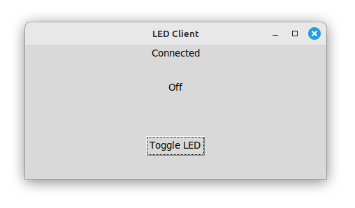

QueClient
=========

If you prefer to run the async code in one thread, and perhaps a GUI display in another, a common method would be to introduce queues to pass data between threads.

A class 'QueClient' in module indipyclient.queclient is available if you wish to use it, together with a function that when called with transmit and receive queues will instantiate and run the class.

.. autoclass:: indipyclient.queclient.QueClient

.. autofunction:: indipyclient.queclient.runqueclient

The events transmitted as items in these queues are described as:

To do ...

An example GUI client, created with tkinter, to operate an LED gives a window:

The LED driver, and the gui client code examples are available at:

https://github.com/bernie-skipole/inditest/tree/main/gui
